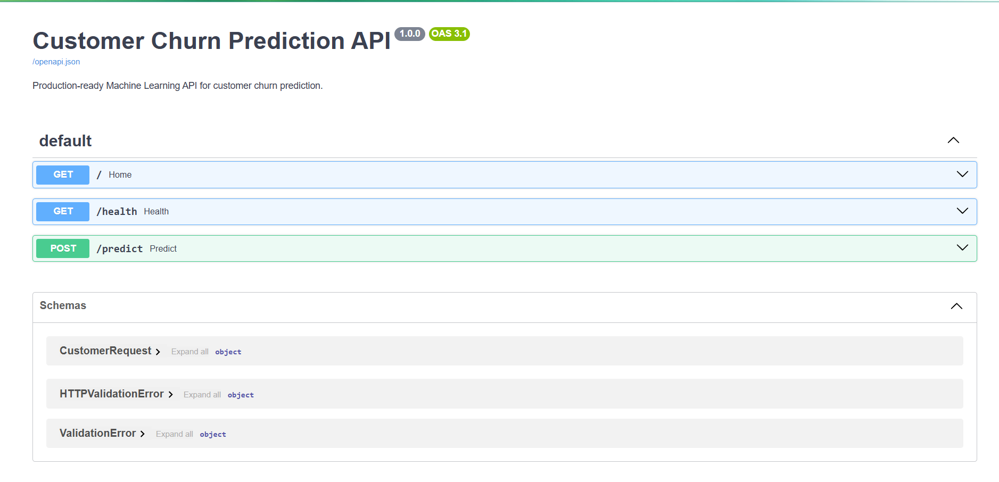
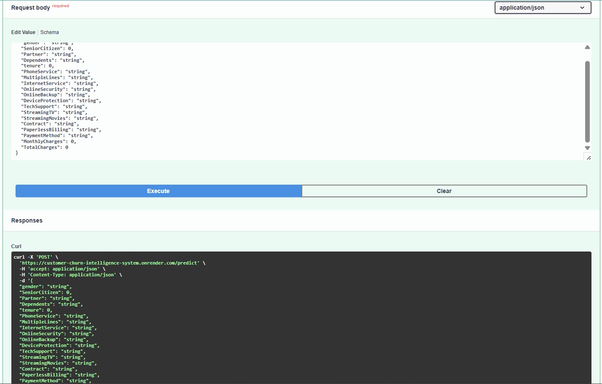
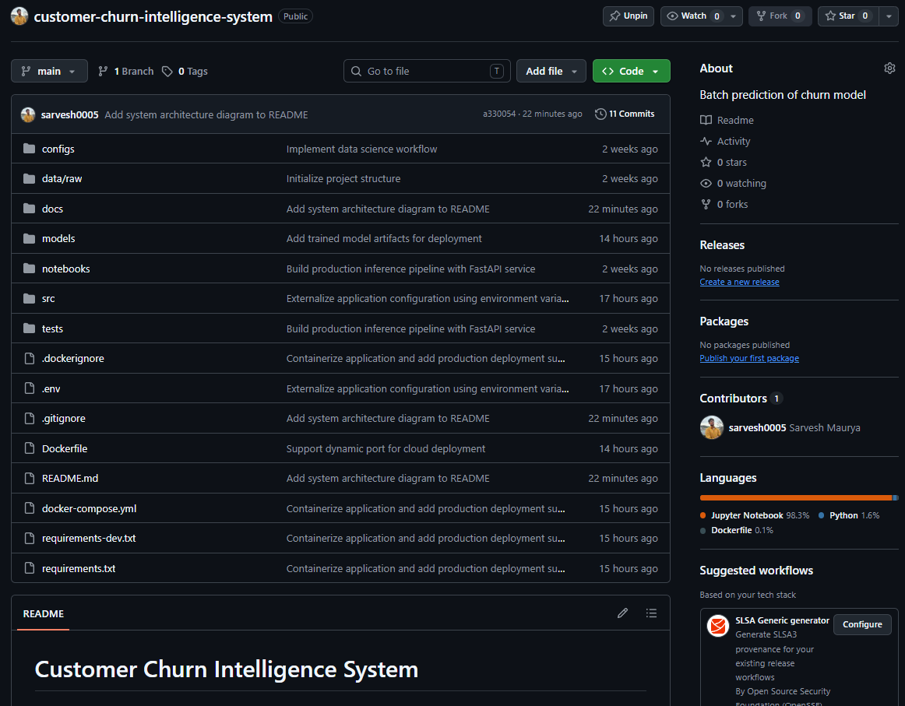
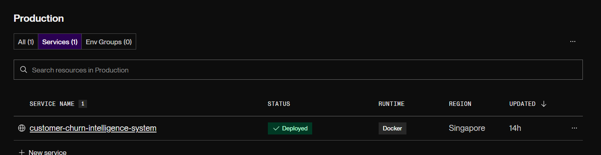

# Customer Churn Intelligence System

This project predicts whether a telecom customer is likely to leave the service and provides a business recommendation based on the predicted risk.

This project is built as an end-to-end machine learning application instead of just a trained model. It includes data preprocessing, model training, a FastAPI backend, Docker support, and deployment on Render, making the model accessible through a REST API.
## Live Demo

- **API:** https://customer-churn-intelligence-system.onrender.com
- **Swagger UI:** https://customer-churn-intelligence-system.onrender.com/docs

## Project Overview

Customer churn is one of the biggest challenges for subscription-based businesses because losing existing customers is often more expensive than acquiring new ones. Predicting which customers are likely to leave allows companies to take proactive retention actions.

The goal of this project was not only to train a machine learning model but also to build a complete inference system that can be deployed and used in a production-like environment. The application accepts customer information through a REST API, processes the input using the same preprocessing pipeline used during training, predicts the probability of churn, and returns both the prediction and a business recommendation based on the customer's risk level.

The project follows a modular structure with separate components for preprocessing, prediction, API services, configuration management, and deployment.

## Project Highlights

- End-to-end machine learning inference pipeline
- Production-ready FastAPI backend
- Dockerized application
- Cloud deployment on Render
- Business recommendation engine
- Interactive Swagger API documentation

## Key Features

- Predicts customer churn using an XGBoost classification model.
- Uses a saved preprocessing pipeline to ensure consistent predictions.
- Provides business recommendations based on predicted churn risk.
- Exposes predictions through a FastAPI REST API.
- Validates requests using Pydantic models.
- Containerized with Docker for consistent deployment.
- Deployed on Render with interactive Swagger API documentation.
- Organized using a modular and production-oriented project structure.

## System Architecture


<p align="center">
  
</p>

## Project Structure

```text
customer-churn-intelligence-system/
│
├── configs/                 # Configuration files
├── docs/
│   └── images/              # README images
├── logs/                    # Application logs
├── models/                  # Trained model artifacts
│   ├── model.pkl
│   ├── preprocessor.pkl
│   ├── feature_columns.json
│   └── metrics.json
├── notebooks/               # Model development and experiments
├── src/
│   ├── api/
│   ├── config/
│   ├── core/
│   ├── schemas/
│   ├── services/
│   └── utils/
├── Dockerfile
├── docker-compose.yml
├── requirements.txt
├── .env
└── README.md
```

## Technology Stack

| Category | Technologies |
|----------|--------------|
| Programming Language | Python |
| Machine Learning | XGBoost, Scikit-learn |
| Data Processing | Pandas, NumPy |
| API Framework | FastAPI |
| Validation | Pydantic |
| Deployment | Docker, Render |
| Documentation | Swagger UI |
| Version Control | Git, GitHub |

## Machine Learning Pipeline

The prediction workflow follows the same preprocessing steps used during model training to ensure consistent results during inference.

```text
Customer Data
      │
      ▼
Input Validation (Pydantic)
      │
      ▼
Data Preprocessing
      │
      ▼
Feature Transformation
      │
      ▼
XGBoost Model
      │
      ▼
Churn Probability
      │
      ▼
Risk Assessment
      │
      ▼
Business Recommendation
      │
      ▼
JSON Response
```

## Model Performance

The final model was selected based on **ROC-AUC** on the held-out test set, with **recall for the churn class** used as a secondary criterion since identifying customers at risk of leaving is more important than maximizing overall accuracy.

### Selected Model

| Model | XGBoost |
|--------|----------|
| Selection Criterion | Highest ROC-AUC with strong churn recall |
| Test ROC-AUC | **0.8443** |
| Cross-Validation ROC-AUC | **0.8471** |

### Test Performance

| Metric | Score |
|---------|------:|
| Accuracy | **74.24%** |
| Precision | **50.95%** |
| Recall | **79.14%** |
| F1 Score | **61.99%** |
| ROC-AUC | **84.43%** |

### Model Comparison

| Model | Accuracy | Precision | Recall | F1 Score | ROC-AUC |
|--------|---------:|----------:|-------:|---------:|--------:|
| **XGBoost** | **74.24%** | **50.95%** | **79.14%** | **61.99%** | **84.43%** |
| Random Forest | 74.24% | 50.94% | 79.95% | 62.23% | 84.11% |
| Logistic Regression | 73.88% | 50.52% | 78.34% | 61.43% | 84.07% |
| Decision Tree | 73.46% | 50.00% | 82.09% | 62.15% | 83.46% |

### Best Hyperparameters

```text
Learning Rate : 0.05
Max Depth     : 3
Estimators    : 200
```

### Business Perspective

- The model correctly identifies approximately **79% of customers who are likely to churn**, making it suitable for retention campaigns.
- **ROC-AUC of 84.43%** indicates good discrimination between churn and non-churn customers.
- The model prioritizes **high recall** to reduce the number of at-risk customers that go undetected.

### Prediction Workflow

1. The client sends customer information to the `/predict` endpoint.
2. FastAPI validates the request using Pydantic models.
3. The saved preprocessing pipeline transforms the input features.
4. The processed data is passed to the trained XGBoost model.
5. The predicted probability is converted into a churn risk level.
6. A business recommendation is generated based on the predicted risk.
7. The API returns the prediction, confidence score, risk level, and recommended action.

## Screenshots

### API Documentation

The application provides interactive API documentation using Swagger UI, making it easy to test endpoints and understand request and response formats.

<p align="center">
  
</p>

---

### Prediction Response

Example prediction returned by the API after processing customer information.

<p align="center">
  
</p>

---

### Project Repository

Repository structure showing the modular organization of the project.

<p align="center">
  
</p>

---

### Cloud Deployment

Application successfully deployed on Render.

<p align="center">
  
</p>

## Getting Started

### Clone the Repository

```bash
git clone https://github.com/<your-username>/<your-repository>.git
cd <your-repository>
```

### Create a Virtual Environment

```bash
python -m venv .venv
```

Activate the environment

**Windows**

```bash
.venv\Scripts\activate
```

**Linux / macOS**

```bash
source .venv/bin/activate
```

### Install Dependencies

```bash
pip install -r requirements.txt
```

### Run the Application

```bash
uvicorn src.api.app:app --reload
```

The API will be available at:

```
http://localhost:8000
```

Swagger Documentation:

```
http://localhost:8000/docs
```

## Running with Docker

Build the Docker image

```bash
docker compose build
```

Start the application

```bash
docker compose up
```

The application will be available at:

```
http://localhost:8000
```

## API Endpoint

| Method | Endpoint | Description |
|--------|----------|-------------|
| POST | `/predict` | Predicts customer churn and returns a business recommendation. |


## Example Response

```json
{
  "status": "success",
  "data": {
    "prediction": "Yes",
    "probability": 0.9641,
    "confidence": 96.41,
    "risk_level": "High",
    "priority": "Immediate",
    "recommended_action": "Assign retention specialist, offer premium discount, and contact customer within 24 hours."
  }
}
```


## Future Improvements

- Add automated model retraining pipeline.
- Integrate MLflow for experiment tracking.
- Implement model performance monitoring.
- Add authentication and rate limiting for the API.
- Deploy on AWS using container orchestration.


## Contributing

Contributions, suggestions, and improvements are welcome. Feel free to fork the repository, create a new branch, and submit a pull request.

## Contact

**Author:** Sarvesh Maurya

- GitHub: https://github.com/sarvesh0005
- LinkedIn: https://www.linkedin.com/in/sarvesh-maurya005

## License

This project is licensed under the MIT License. See the [LICENSE](LICENSE) file for more details.